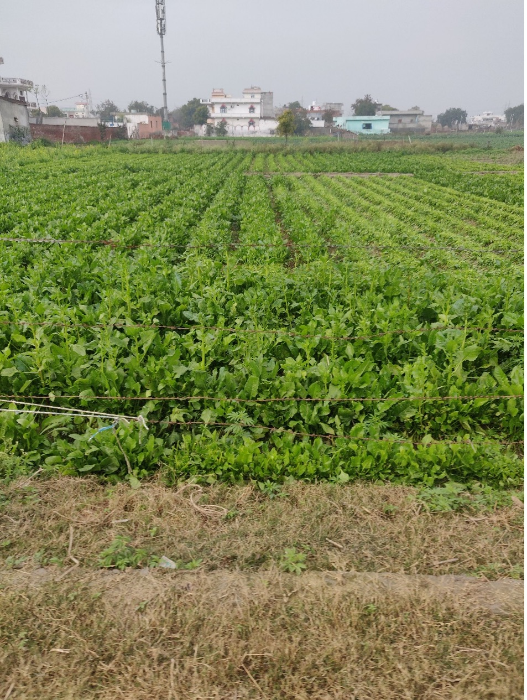
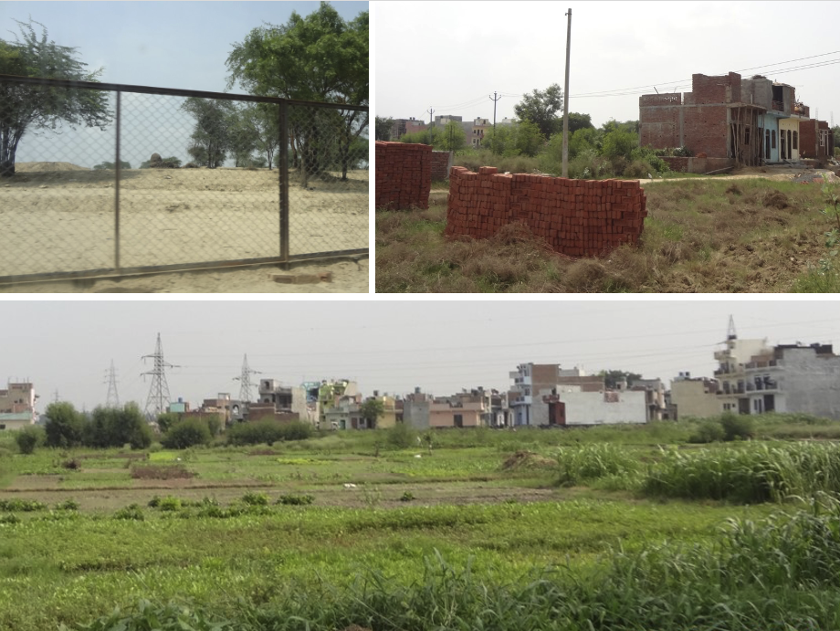
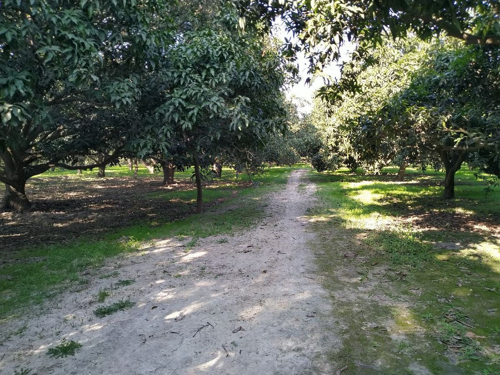
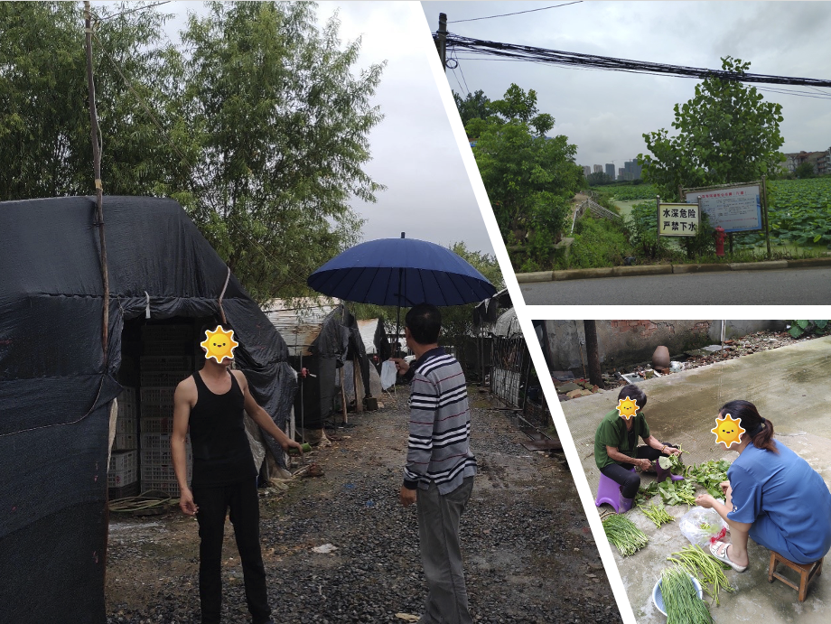
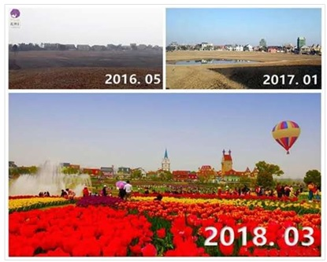
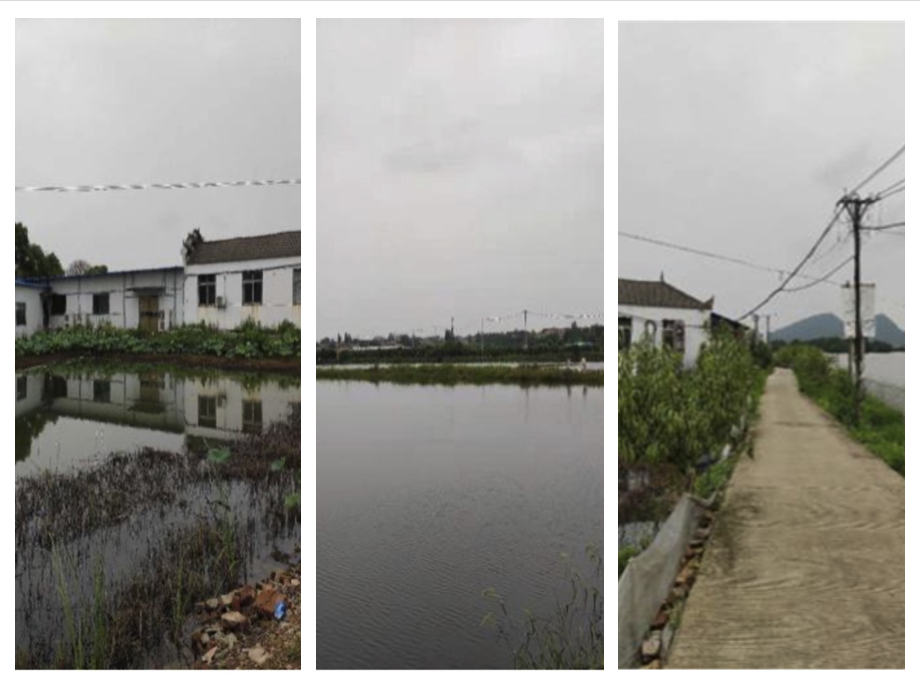
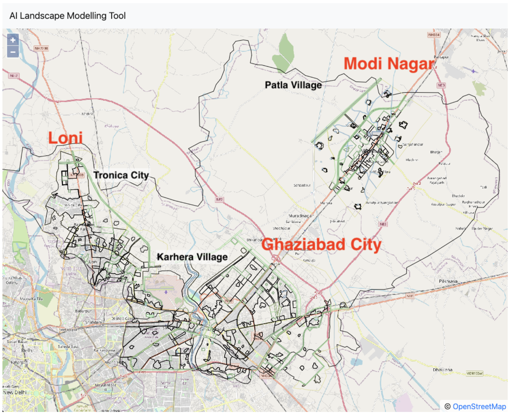
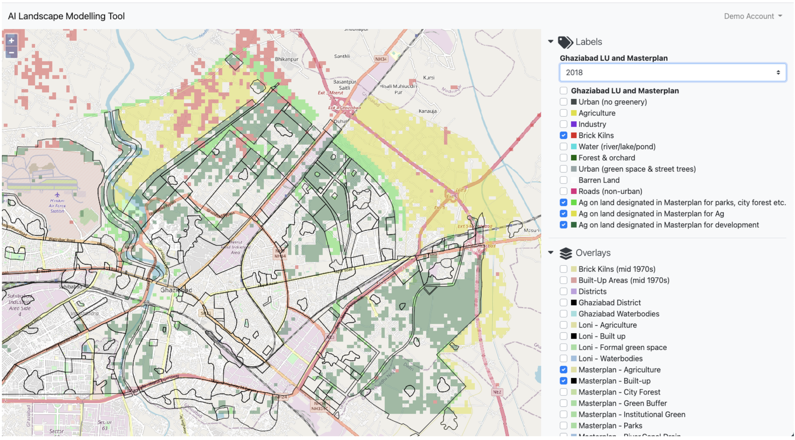
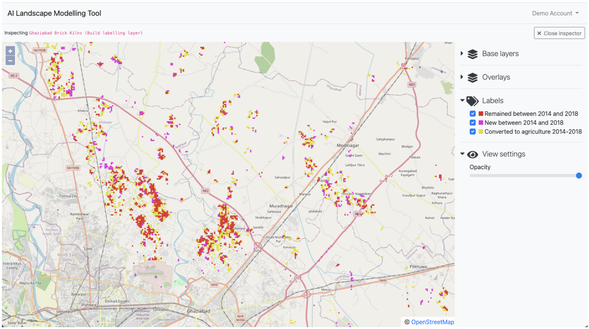
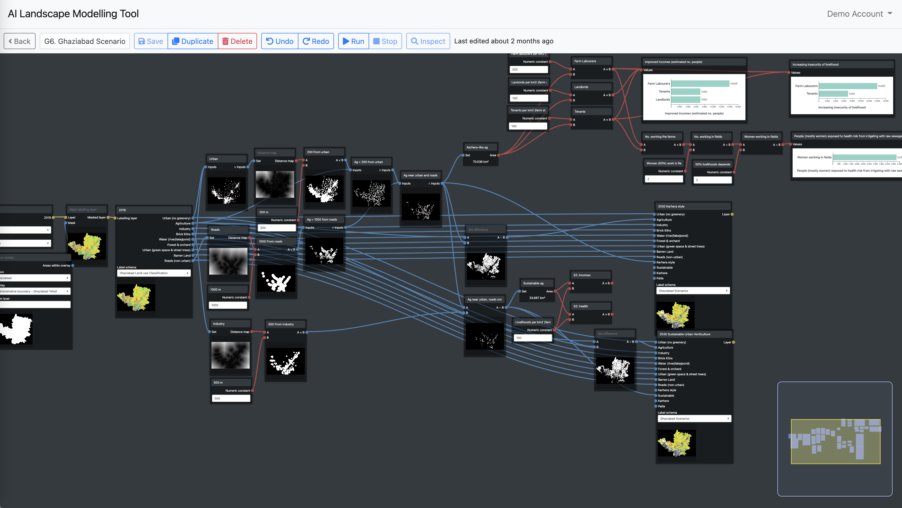

## Urban green infrastructures

Urban infrastructures can be understood as the systems through which urban services are provided. These include the ‘green infrastructure’ of urban parks, street trees, green surfaces, community gardens and urban agriculture. Some types of green infrastructure are formally recognized and planned – such as parks, city forests, urban waterways – while others are largely ignored or considered unimportant – such as peri-urban agriculture.

Green infrastructures in peri-urban areas (areas adjacent to an urban area or where urban and rural activities co-exist) are threatened when construction projects, polluting industries, waste disposal, or large-scale cash crops compete for space with small-scale agriculture, common lands or conservation areas. The green infrastructures which are disappearing, tend to be those that support the livelihoods of the peri-urban poor (especially agriculture), supply vital urban environmental services (such as groundwater recharge) and provide food to the city. They also provide a host of other health and social service benefits. They are often replaced by new urban landscapes with formalized green infrastructures of parks, landscaped grounds and street trees.

## Project aims

The ‘Inclusive Green Infrastructures for Urban Well-Being’ project aimed to contribute to the long-term well-being of diverse urban and peri-urban residents by revealing the possibilities for integrating green infrastructures into city policy and planning in China and India. Our goal was to create a user-friendly [web-based mapping tool](https://landscapes.wearepal.ai/) that could be used to support stakeholder engagement and planning discussions on the role of green infrastructures in peri-urban development.

## Fieldwork and spatial mapping

Researchers at JNU and ZUEL gathered data through fieldwork conducting surveys and interviews in several peri-urban case study sites in Ghaziabad and Wuhan to investigate the multiple benefits of different types of green infrastructure and the effects of development processes on them.

At the same time, a web-based land-use mapping tool was developed that built on a prototype created through an SSRP funded project. This web-app enabled a novel AI-assisted land-use mapping approach to mapping finely grained land-use changes at city-region scale.

### Ghaziabad

In Ghaziabad the JNU team carried out interviews and focus groups in three case study sites of peri-urban villages in Ghaziabad district - Khanpur Japti (Tronica City), Karhera, Patla - each with contrasting experiences of peri-urban development.

Khanpur Japti was once a pastoral community but has experienced a drastic change in its livelihood patterns after land was acquired in the 90s for developing the industrial township of Tronica city. Some villagers, however, still depend on animal husbandry for sustenance while few have branched out into diverse agricultural practices like vegetable cultivation, floriculture and fodder production. 

Karhera, is also a village in transition that despite the real estate boom continues to be involved in vegetable cultivation in large parts. The grazing land in the village has recently been converted into a city forest under the urban greening project.

Patla, on the other hand, presents a stark contrast with the previous two sites. Although it is city council area there is not yet much industrial development and the majority of land is under mango orchards or sugarcane cultivation. Local livelihoods largely depend on sugarcane production, with local villagers engaged at different points in the chain from cultivation to marketing of final output.

### Wuhan

In Wuhan the ZUEL team visited four case study sites to conduct interviews and surveys. These represented a range of green infrastructures from more formal recreational parks to informal agriculture.

In Honglian village, Huangpi district, there is a mixture of industrial and urban land-uses that provide jobs for local residents while wetland and vegetable farming mainly supports the livelihoods of migrant farmers. Jinkou village in Jiangxia district is another example of informal green infrastructure where local farmers lease land to migrant farmers who grow vegetable for urban markets.

In contrast to these two villages, the Flower Village in Caidian district is a large-scale formal privately managed green infrastructure project that has converted farmland and idle lands into an ecological tourist park that employs locals as gardeners and supports a range of small businesses serving visitors.

Jingxiu Earth Eco-Park provides another example of formal green infrastructure as a government subsidized demonstration project of eco-agriculture tourism in Caidian district of Wuhan. 

### Spatial Mapping

The web-app contributed in several ways as part of the mixed methods research process. As a mapping tool it revealed discrepancies between planned and actual land-uses at the level of urban masterplans. As a land-use change analysis tool it was useful for identifying which types of land-use change seemed most significant and how these changes were distributed across the city-region so that we could then take a closer look via fieldwork. It also enabled us to quantify and visually demonstrate the the scale of changes across the city-regions. Finally, as a modeling tool there is potential, given the right kind of additional data, for the web-app to be used to explore the implications of different scenarios of land-use change into the future.

#### 1. Revealing discrepancies between planned and actual land-use

By digitizing masterplans and overlaying them with classified land-use in the web-app we could show the contrast between planned formal land-use and informal land-use in masterplan areas.

For example, in Ghaziabad we used the web-app to compare three urban masterplans within Ghaziabad district with actual land-use in 2014 and 2018 to show that agriculture still occupies a much larger peri-urban area than is formally recognized or planned for.
 

#### 2. Identifying areas for further investigation across the city-region

In Wuhan and Ghaziabad the maps produced by the web-app have been used to discover patterns and changes in land-use that are relevant to understanding the wider context of peri-urban agriculture but could otherwise have been easily missed.

For example, in Ghaziabad, analysis with the web-app revealed, not only the extent of informal brick kilns but also the unexpected land-use changes from brick kilns back to agriculture which we could then investigate in more detail by focusing fieldwork in those areas.

In Wuhan, the land-use change maps revealed where farmland had shifted from one form of agriculture to another such as from grain, or fish ponds to vegetable cultivation or from vegetable cultivation by locals to migrants. This helped to narrow down the search for fieldwork sites that would allow us to understand the contrasting experience of local and migrant farmers in peri-urban agriculture. 

#### 3. Demonstrating the scale of changes in peri-urban green infrastructures

The maps and models created in the web-app were able to demonstrate the scale and spatial pattern of land-use changes across the city-regions. This helped to put the insights emerging from fieldwork into the wider context of change. For example, in Wuhan the land-use analysis demonstrated the significant extent of involvement of migrant farmers in vegetable cultivation around Wuhan as well as the scale of displacement of these migrant farmers by urban expansion.

#### 4. Modeling land-use change

The web-app's modeling interface has been developed to allow users to build visual models of land-use change and visualize each step in the modeling process. It also supports designing future scenarios of land-use change that can include additional types of spatial data such environmental or social indicators. In future iterations of the web-app the aim would be to be able to model potential future scenario to demonstrate impacts on aspects of well-being, food security, and environmental outcomes.

### Engagement with stakeholders

To facilitate research discussions and engagement with local stakeholders we have created various maps and models in the web-app itself as well as presenting elements of these maps and models alongside photos and insights from fieldwork in the form of Story Maps (see Wuhan and [Ghaziabad](https://arcg.is/1SyurG) Story Maps).

Using the web-app and Story Maps we have begun to see the potential to use the web-app in Ghaziabad and other peri-urban contexts to democratise city-region planning processes as a boundary object to support the involvement of stakeholders in planning discussions and also to facilitate alliance building among community groups and activists and NGOs operating at wider district or city-region levels.

As a boundary object to bring together different stakeholders the web-app can stimulate discussion about the significance of peri-urban land-use and land-use change for different aspects of well-being for different groups. This can help planners, activists and community members to share knowledge and also to recognize the wider context of change in which their own livelihoods are situated.

For example, in community workshops in Ghaziabad one of the powerful impacts of the mapping tool alongside presentation of insights from the qualitative fieldwork has been the ability to describe the experience of more industrialized peri-urban villages (i.e. Tronica City and Karhera) as showing an example of the potential future of the still largely rural peri-urban areas (i.e. Patla) which may be poised for the next wave of development. This has then raised questions about the trade-offs involved in the urbanization and industrialization of largely agricultural peri-urban villages which may bring employment and wealth for some land-owners at the expense of worsening environmental pollution that may make the area unlivable in the future. This can then open the door to discussions about possible alternative future trajectories such as modifying development plans to include support for permanent peri-urban farming areas where regenerative agricultural practices can be promoted that foster synergies with urban land-uses through waste recycling and community supported food systems.