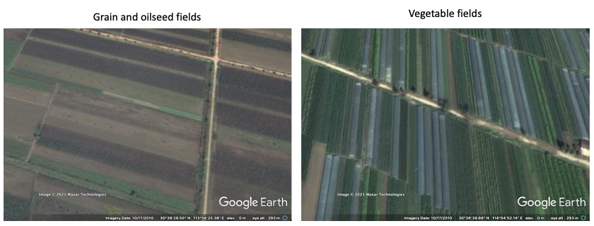
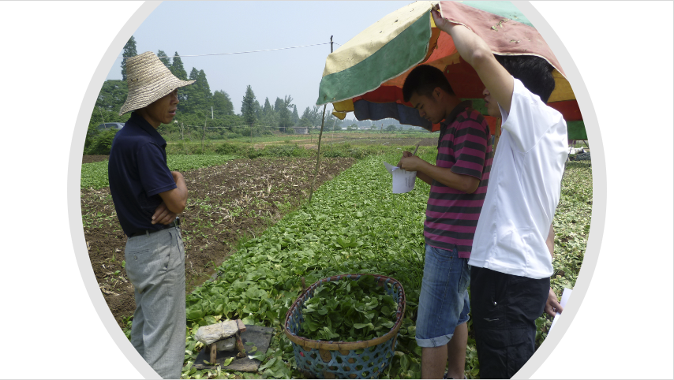
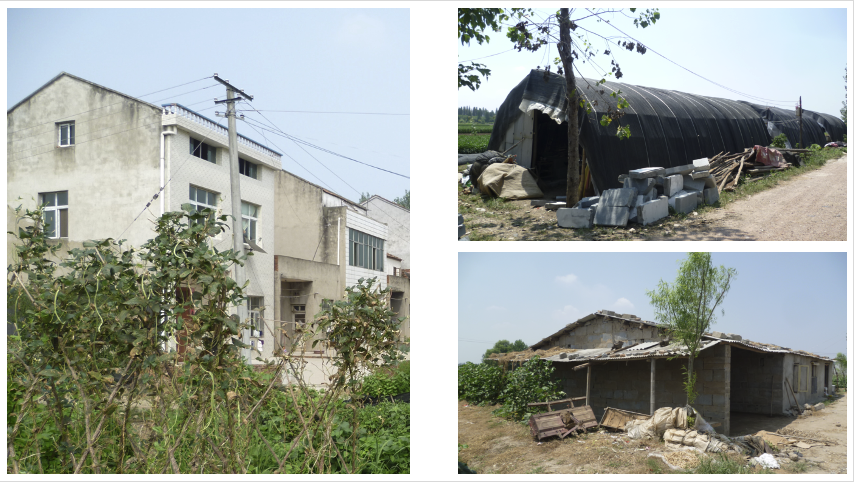
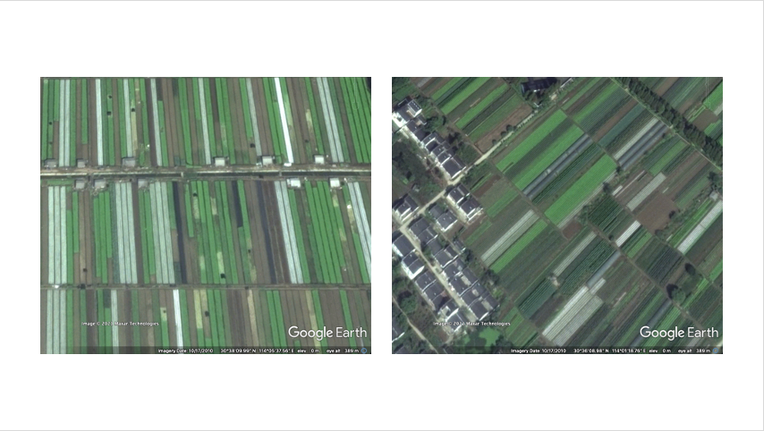
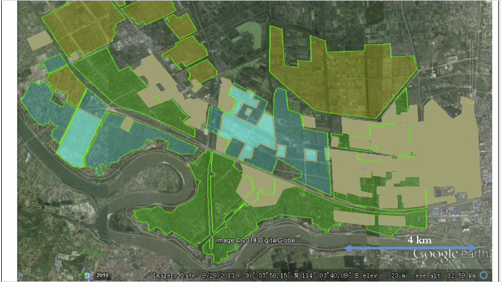

<!--more-->

> In this post, Jonathan Dolley gives his perspective on the creation of the landscape modelling web-app. The app itself can be accessed here: https://landscapes.wearepal.ai/

For my PhD research in Wuhan I wanted to understand the peri-urban food system and, in particular, the situation of vegetable farmers and their role in urban food security.

While I was doing fieldwork there in 2011, I found that the only accessible official data on peri-urban agriculture was on area and economic value of different types of agricultural production aggregated at city and district level So I knew the area and value of vegetable cultivation as a general category, but I had no data on the circumstances in which vegetables were produced and distributed.
I also had no obvious way to locate vegetable production areas.

So I started looking on google earth  and noticed that I could pick out the distinctive narrow strips of open field vegetable cultivation alongside the polytunnels used to grow off-season vegetables.

Using google earth I identified and visited as many of these areas as I could and interviewed farmers there. I discovered that many of these vegetable producers were out-of-town migrants who were renting land from local farmers or village committees and growing vegetables for the urban wholesale markets.

I also noticed that the migrants typically built small single story houses or tents on the corners of their rented fields while local farmers lived in the nearby villages of clustered multi-story houses.

When vegetable cultivation was by migrants their field-side dwellings were present and when vegetable cultivation was by locals, obviously they were absent. These features are clearly visible in the following google earth imagery.

These details were identifiable from google earth so I was able to uses this knowledge to map by hand the changing distribution of local vs migrant vegetable production using historical google earth imagery and show how the gradual displacement of migrant farmers occurred as urban expansion continued.

At the time, I wondered if it would be possible to develop a tool to map these changes in peri-urban agriculture at this level of detail for the entire city-region. Back then, the main tools for that type of mapping were complex GIS software that were expensive to access and required a significant amount of training to use. They were also designed for either fine-grained surface cover classification at the level of city blocks or or global data analysis of much coarser datasets than would be useful for peri-urban analysis.

A few years later, machine learning was becoming more and more popular and in particular for image classification. So I wondered if such techniques could be used to classify google earth satellite and aerial imagery to distinguish the different types of peri-urban agriculture I had seen in Wuhan. To cut a long story short, with Fiona Marshall, Novi Quadrianto and Jeremy Reffin of the Informatics department at Sussex we got funding from the internal funding program the [Sussex Sustainability Research Programme](https://www.sussex.ac.uk/research/centres/sussex-sustainability-research-programme/), to test out this idea as a web-app that could provide a more accessible way for people to do this kind of machine learning assisted land-use classification.

The first phase of development under the SSRP led to a working prototype which was then developed further as part of our British Academy funded project 'Inclusive Green Infrastructures for Urban Well-being.'

In this second phase we worked with Zhongnan University of Economics and Law in Wuhan and JNU in Delhi to further develop the web-app to map urban and peri-urban agricultural land-use in Wuhan and Ghaziabad alongside fieldwork in several case study sites in both cities.

Some of this material has been presented in the form of arcgis story maps for [Wuhan](https://storymaps.arcgis.com/stories/e5de902ce6664ea587cf503e265d6f31) and [Ghaziabad](https://arcg.is/1SyurG).

The web-app project page can be found here: [wearepal.ai/projects/ssrp](https://wearepal.ai/projects/ssrp) with a brief description and a list of development team members. 

For more detailed description of the web-app's features visit the [Web-app](/web-app) page on this site.

Finally, this video provides an overview of the web-app's functions:

<iframe width="560" height="315" src="https://www.youtube.com/embed/5MnnAMaIACQ" title="YouTube video player" frameborder="0" allow="accelerometer; autoplay; clipboard-write; encrypted-media; gyroscope; picture-in-picture" allowfullscreen></iframe>
