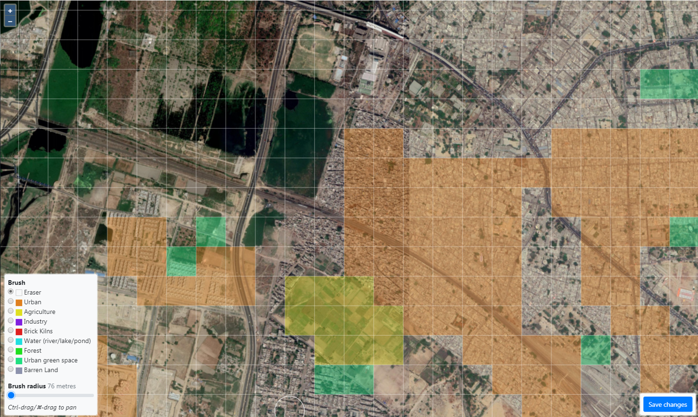
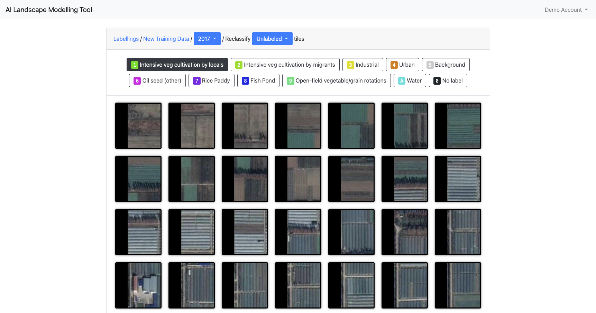
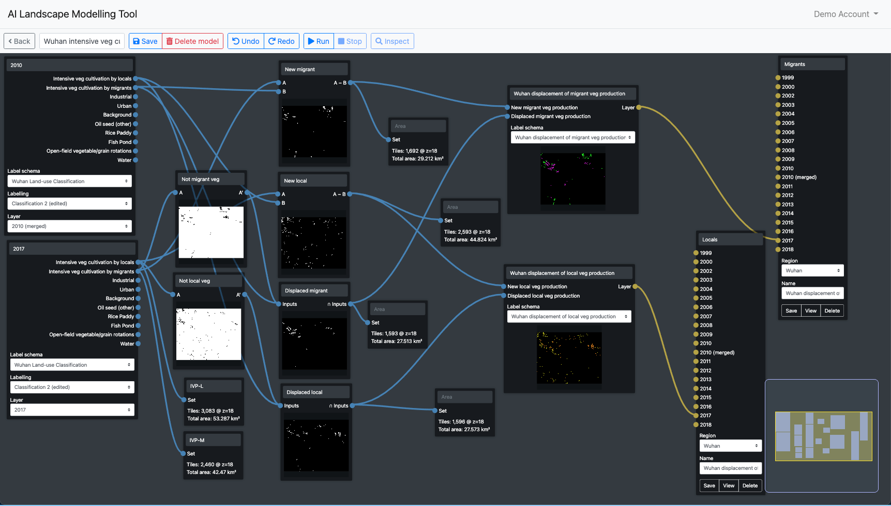
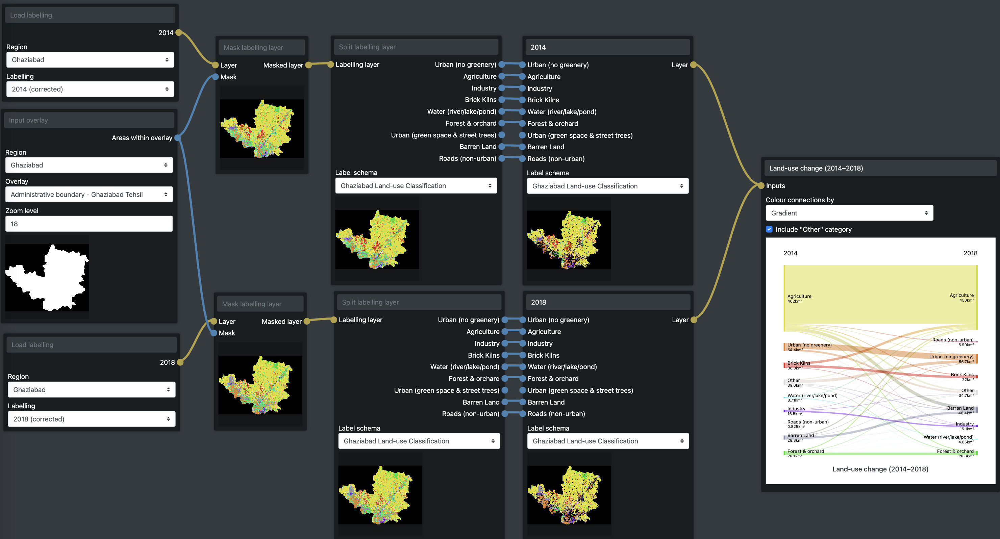
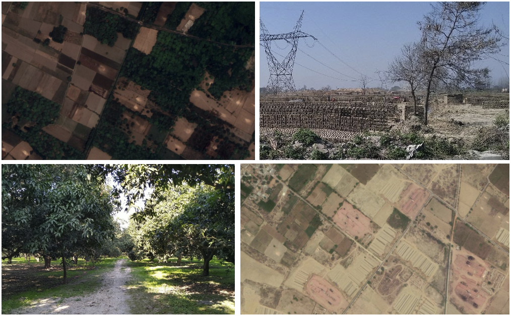

---
# Page title
title: Introducing the web-app

# Title for the menu link if you wish to use a shorter link title, otherwise remove this option.
linktitle: Intro

# Page summary for search engines.
summary: The development of a web-app for land-use change mapping and analysis was one of the core outputs from the project. This article provides a detailed description of the web-app's features and how these were used alongside fieldwork in Wuhan and Ghaziabad.

# Date page published
date: 2022-01-13

# Book page type (do not modify).
type: book

# Position of this page in the menu. Remove this option to sort alphabetically.
weight: 1
---

## Key features of the web-app

The specific mapping and modelling objectives for this project were as follows:

1. Illustrate the nature, extent and significance of different types of peri-urban GI (with emphasis on peri-urban agriculture and water sources).
2. Assess changes in GI over time in relation to various city region development trajectories.
3. Demonstrate implications of changes in GI for well-being of different groups.
4. Develop a tool that Integrates formal top-down data with maps of actual/informal land use and evidence of communities lived experiences to support multi-stakeholder dialogue on inclusive GI and city region development.

### AI assisted crowd source land-use classification system

We began the mapping part of this current project by exploring ways to overcome the challenge of mapping (at city-region scale) land-use in peri-urban areas which are characteristically highly dynamic, fragmented, heterogenous, and informal.

Our mapping approach used aerial imagery downloaded from Google Earth Pro, which is freely available and, while not processed to the same quality as satellite imagery such as Sentinel 2, is higher resolution (around 1 m). We used machine learning to classify land-use tile-by-tile.

Once the GE imagery had been downloaded it was cut into tiles and uploaded to the web-app so that training data could be labelled from within the web-app itself. The web-app interface was specifically designed to facilitate this process by which the user selects a label and 'paints' over the satellite imagery to label each tile accordingly:

The AI classifier was then trained on this labelled data and the result uploaded to the web-app to be viewed and corrected by hand. Again, the web-app interface was developed to facilitate this process of visual analysis of features such as field-patterns, textures, object shapes etc. The correction interface presents a single category of tiles as classified by the AI which the user can view and apply alternative labels to any tiles that appear to be incorrect:

One motivation behind the design of this process is that it allows for crowd-sourced classification correction through the web-app. The AI classifier does the majority of the work while human users can enhance the accuracy and reliability of the result.[^wap-1] 

[^wap-1]: Potentially this process could be implemented iteratively: 1) initial labelling is used to train the AI; 2) human expert or crowd-sourced correction of the classification result is used to provide additional training data to the improve the AI classifier's future performance; 3) finally, a sample of the classified tiles is moderated by the user to determine the accuracy of the result and verify the final classification map for use in models.

### Map viewer

The final corrected classification map can then be viewed in the web-app alongside other map layers including the original aerial imagery, a street map and overlays of other features which are uploaded as GeoJSON shapefiles:

For example, in this map of Ghaziabad the land-use classification is viewed alongside an imported masterplan map:

One important feature of the map viewer is that the view settings and map layers that the user selects are all encoded in the URL. This means that the user can share a link which will point directly to the exact same view that they have open.

### Modelling interface

The land-use classification and any additional map overlays can then be used in the web-app's modeling interface to create land-use change maps and graphs:

The modelling interface is designed to enable simultaneous visualisation of each step of the model building process. This means that a user can see clearly the result of each step in the model, allowing for a more iterative and exploratory style of model building.

The modelling interface enables the user to:

1. Create new land-use maps that combine land-use classes or split classes into sub-classes, for example based on proximity to certain map features or other land-uses.
2. Generate land-use change maps based on classifications from two time points.
3. Identify specific areas based on a set of criteria. For example, you might want to find all the areas of vegetable cultivation that were newly cultivated since a certain time and are within a certain distance from industrial areas.
4. Generate graphs based on areas of land-use or land-use change.
5. Visualise land-use changes in a sankey diagram (see below).

By combining the use of land-use classification map layers along with other imported layers, such as masterplans, the modelling interface can also generate maps that reveal the intersections between two or more map layers. For example the following map shows which classified land-uses intersect with which masterplan land-use clasess:

## Using the web-app in research

The web-app was used in a number of ways as part of the broader research process alongside fieldwork in Ghaziabad and Wuhan.

### Mapping agricultural land-use change in Wuhan

In Wuhan, we used the web-app to map the extent and changes in different types of agriculture showing shifts in some areas from grain to intensive vegetable cultivation. Based on fieldwork insights we have also mapped the presence of huts among fields of intensive vegetable cultivation that indicate the involvement of out-of-city migrants as tenant farmers.

Even though their presence is not revealed in conventional mapping methods or official data, we are able to demonstrate the scale of involvement of migrant farmers in intensive vegetable production around Wuhan and reveal their large-scale displacement by urban expansion driven by industrialization.

In contrast, more recently the masterplans, policies and recent formal greening initiatives indicate a shift from industrial development towards eco-tourism in peri-urban areas. Through fieldwork involving interviews and surveys we explored the significance for livelihoods of local and migrant farmers of these different peri-urban green infrastructure strategies. On the one hand, the informal transformation of agriculture to intensive vegetable cultivation represents a significant contribution to food production and livelihoods from agricultural green infrastructures. While on the other hand, the formal transformation from traditional villages to eco-tourism landscapes offers a contrasting vision for peri-urban green infrastructure development.

The following map shows the location of intensive vegetable cultivation around Wuhan in 2017. Areas of vegetable cultivation by migrant famers are indicated in purple, while vegetable cultivation by local farmers are indicated in yellow. To view the map in the web-app [click here.](https://landscapes.wearepal.ai/#127jxqqdnPTUVbRd9)

Out of a total of around 96 km2 of intensive vegetable cultivation, at least 45% is by migrant farmers.

In terms of land-use change, analysis also showed that 75 km2 of farmland was converted to vegetable production between 2010 and 2017 while around 45 km2 was lost to other land-uses. 50% of this loss was experienced by migrant vegetable farmers who were displaced from 27 km2 of farmland between 2010 and 2017. It is likely that this displacement represented a loss of property and livelihood with very little or no compensation. On the other hand, the local farmers or state owned farms that held property/use rights to this land would have received some form of compensation for the loss of land and property.

The other 50% of vegetable cultivation lost to other land-uses was land cultivated by local farmers. For these local farmers, while involving a loss of livelihood or a component of their livelihood, they too would have received compensation for lost land and property on the basis of their formal legal ownership.

These findings reflect a large-scale change in land-use and the peri-urban agricultural economy, much of which is informal. Neither is it detectable by conventional methods, and yet it has important and very different implications for the different stakeholders involved.

### Comparing formally planned land-us with actual land-use in Ghaziabad

In Ghaziabad, we found it possible to distinguish between arable fields and orchards or forest cover. However, it was impossible to detect different types of agriculture beyond these two classes because, unlike in Wuhan, there were no discernible clusters of distinctive field patterns to indicate different types of crop.

Despite this, we were still able to reveal the presence of informal agriculture where formal plans claim other land uses. We were also able to identify brick kilns and to show where they occupied former farmlands or were reconverted back to agriculture. Finally, barren land was also distinguishable from cultivated land which enabled us to show where farmlands had been cleared in advance of urban redevelopment, as for example in the Tronica City area of Ghaziabad.

The mapping guided further fieldwork to reveal the degradation of ecosystems caused by these land-use changes as well as to understand the implications of positive examples of green infrastructures supporting peri-urban livelihoods.

In this map you can see the changes in brick kilns in Ghaziabad between 2014 and 2018. To view in the web-app [click here.](https://landscapes.wearepal.ai/#127PoJ95sHbNg1YnKrjR)

This clearly reveals the extent of brick kilns which are not identified in formal plans. It also reveals the unexpectedly large area of brick kilns being converted back into agriculture just as new brick kilns are also being constructed. In response to this finding, we adapted our fieldwork to investigate the reasons behind these changes from agriculture to brick kilns and back again.

The fieldwork revealed that the clustering of brick kilns may be partly due to the impact they have on the fields around them. Once one kiln is set up, the surrounding farmland become harder to cultivate thus pushing nearby farmers to lease out their own fields for brick making also. In other cases, the impact of brick kilns on nearby agriculture have led to those kilns being shut down to enable farming to continue instead.

It was also claimed that brick kilns where often set up as a temporary step towards improving irrigation. Brick kilns would be operated until the level of the land had been reduced to be low enough so that irrigation water could be easily channeled into the fields. At that point, the brick kilns would be shut down and farming would again continue. The pollution from the brick kilns would be tolerated as a trade-off for the improved irrigation.

Analysis of the land-use maps indicated that between 2014 and 2018 22 km2 of land had remained as brick kilns while 10.5 km2 of new brick kilns had been set up and 23.5 km2 of brick kilns returned to agriculture. Over all, the total area of brick kilns declined from around 50 km2 to 32 km2.

## Challenges and future opportunities

The web-app itself has developed into a powerful tool with potential for a variety of applications in research or stakeholder engagement. In our own project we have begun to explore this potential and you can find out more about this experience in the [about](/about) page on this site.

As a freely accessible tool which can be used online or downloaded as a software package to run on your own computer with your own data we hope that the web-app can be applied in many other research and engagement contexts in the future and even developed further by others. For more technical information about how to make use of the web-app please take a look at the [documentation.](/docs)

We came up against several challenges in the process of building and using the web-app in our own research and we hope that future work can begin to address some of these.

### Complex process for accessing and classifying data

First, the process of obtaining, processing and classifying the data for the mapping process is very complex and time-consuming, which means it is currently only really feasible for use by teams with some degree of specialized skill in GIS. For this reason, we have come to view the web-app more as a research tool to support engagement with stakeholders rather than a tool for public use by non-expert users. However, with more investment we believe there is potential to make this process simpler and better integrated with various data sources that would make the web-app a powerful tool for the general public including civil society groups and NGOs to use even without GIS expertise. For example, it would exciting to have a version as a mobile app which could help local activists and community groups to understand their wider context and engage with policy and planning processes.

### Performance of the AI classifier

The AI classifier output is better for some land-use classes than others is highly specific to the particular context. This means that a significant time investment is needed in labelling training data and correcting or moderating the classifier's output. There any number of potential solutions to this issue such as adding some form of image segmentation to the classification process or drawing on additional data sources to supplement the GE imagery. However, these all add complexity to the process and could not be fully explored within the scope of this project. Given additional resource, we expect that future development would able to significantly improve the performance of the entire process and potentially incorporate various indicators of accuracy. This could then enable users to make informed judgements about how much time to spend on training and improving land-use classifications before they can be confident using them in modelling and scenario building.

### Potential applications of the web-app

The most immediate application of the web-app we envisage is that it would help to support recognition of marginal communities in green infrastructure planning by revealing the scale of and changes in informal land-uses vs formal plans. The modelling functionality could also help stakeholders to explore the implications of different future initiatives and strategies for green infrastructure development. These insights can then help support dialogue around alternative approaches to city-region planning.

Further, with the addition of environmental and socio-economic spatial data, the mapping and modelling functions could enable the identification of locations with potential for integrated green infrastructure planning. Finally, by developing more sophisticated models it would be possible to demonstrate the trade-offs and synergies between different perspectives on green infrastructures with a focus on perspectives of marginalized groups.